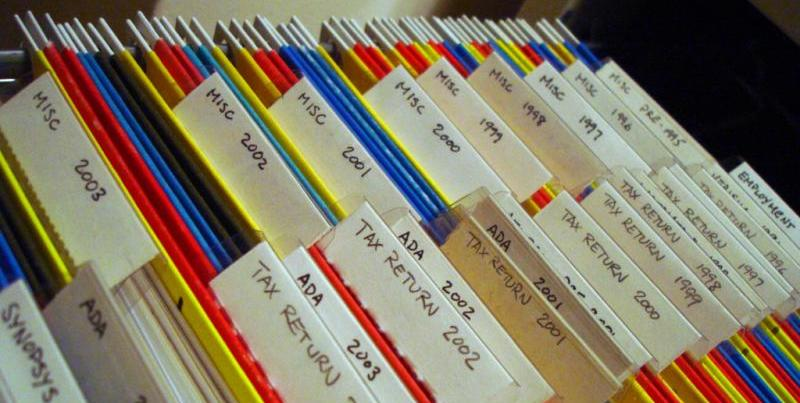

# Keep a record of your work

[Photo by Takashi Toyooka](https://www.flickr.com/photos/takashi/18862634/)

Most conferences will shoot a video or recording of your presentations and it is important for you to watch your talks afterwards. Seeing yourself is a great way to improve as you are most likely your worst critic. One you can’t be angry at. When we speak, our head resonates. That’s why how we hear ourselves is different to what others hear. It is important to get to know the person you project as well as yourself and make sure that how you come across gets better over time. One way to do that is to keep recordings of all the things you present.

Making recordings of your talks and in general your work is a good idea because of several reasons:

- **People who couldn't attend your session get the same information** – a presentation to me is much more than the slide deck – the deck is actually just the table of contents of the talk.
- **You have the chance to check how you come across to the audience** – I normally check my talks on my phone whilst cycling in the gym – good use of the time and I can see where I need to improve.
- **People who prefer audio or video get interested in what you do** – this also includes people who need audio and video because of their condition
- **People like to listen to audio recordings in the car** – videos would be not a good idea.
- **It allows you to publish in other channels** than just your blog or site or conference archive

Recording things is dead easy nowadays – most devices have good microphones and cameras in them and even clip-on mics and earbuds have become much better and more affordable.

## Record the audio of your talks

Most conferences will give you a lapel mike and do some proper audio recording but if that isn't the case or you simply want to have your own copy I found that the built-in microphone of laptop or smartphone is perfectly capable of making a good enough recording of your talk if you don't walk around too much. The other option of course is to get a small external microphone.

For recording, I use [Audacity](http://audacity.sourceforge.net/) which is a free, open source sound editing tool that has all the capabilities you need (record, cut, convert). For storage of audio files, I use [archive.org](http://www.archive.org/index.php) which has a pretty nice uploading tool and comes with a good search functionality and in-built player.

Audio recordings are great as they are comparatively small and people can put them on their phones and listen to them on the train to work. In addition to that slide sharing platforms also allow you to add sound to your presentations to turn them into “slidecasts”.

## Shoot video

Having a video of your presentation or interviews is very nice, much for the same reasons of having an audio recording. As there is audio and video it does give people the full experience of seeing your talk and the success of various developer oriented YouTube channels shows that people love to get videos and use them as training materials.

You can get small cameras with amazing recording quality these days and mobile phones allow you to record and edit on-device. Just get a small tripod, put up your phone in front of you and you already get an OK video.

Hosting is a bit harder – archive.org is again an option but the real power of online video comes from hosting it where people are used to look for videos and can embed them in their own blogs. [YouTube](http://youtube.com/) is of course a main candidate (also because of their editing options and automatic caption generation), but I also love using [Vimeo](http://vimeo.com/). Uploading takes a lot longer than the smaller audio files so it is pretty tough to have a really quick turnaround when you are on the go.

## Link collections

Another great way to record what you have done is using social bookmarking to collect links for a certain event or talk that you've given. Instead of people having to remember all the links you've used in a certain presentation all they have to memorise is a single URL with a tag. That way you can easily add interesting URLs you talked about later on – simply get the link collection with the presentation tag.

The other benefit of this is that people can tag and add notes to your links in the social bookmarking system, thus making them even more findable.

## Keep a conference participation list

One thing that helped me a lot about events I attended is to have an online list of events I will be at and where I was. For the ones that ended, I linked the entry to the resources – my slides, blog posts, links and videos of the event.

This is a great track record of your work and it is also a good reminder to see where you presented and if it makes sense to go again or to hand over the opportunity to a colleague you can coach about the event. It also is a good resource to show to your boss when your performance reviews come around.

Having a list of upcoming talks also helps people who are in the same location of the event to contact you. I’ve had quite a few interesting brown-bag offers by hard-to-access customers as they knew I’d be around their town and they didn’t have the budget to send all their developers to the event.

In addition to the public list it also makes sense to keep personal notes about each event. Who you met, what other talks you saw, how you were treated as a speaker and so on. These can be a gold mine later on when your company wonders about which events to sponsor.