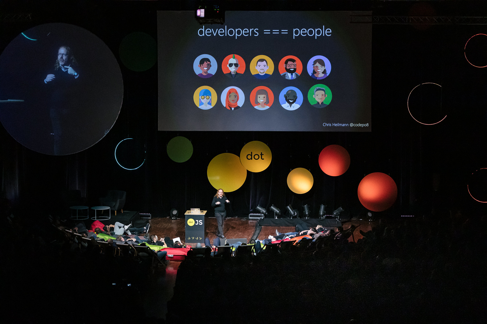

# The Developer Advocacy Handbook

This handbook will get you on the way to be a great developer advocate for any product or company. Naturally, your approach may need tweaking for different markets and audiences - and in accordance with your own personality - but the main principles are the same for everybody and anywhere in the world.

This is a new, 2020 version of this 11 year old book and I added quite a few new chapters and removed outdated materials. You can read more about this in the [about section](https://developer-advocacy.com/about).

Now, why not get right into it? Choose from the [table of contents](https://developer-advocacy.com/toc) or [read the book](https://developer-advocacy.com/what-is-developer-advocacy).

Photo from the DotJS2019 talk [Develop, Debug, Learn?](https://www.youtube.com/watch?v=m4t7cLFksls)

---

© 2009 - 2021 [Christian Heilmann](https://christianheilmann.com/)

The Developer Advocacy Handbook by [Christian Heilmann](http://icant.co.uk/) ([email](mailto:chris@christianheilmann.com)), a Principal Program Manager living and working in Berlin, Germany is licensed under a [Creative Commons Attribution-Non-Commercial-No Derivative Works 2.0](http://creativecommons.org/licenses/by-nc-nd/2.0/). Based on a work at [developer-evangelism.com](http://developer-evangelism.com/).